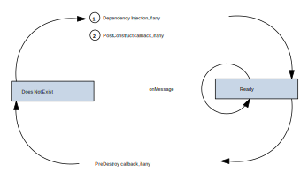
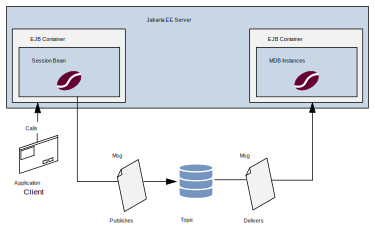

<!-- .slide: data-background-image="https://www.10wallpaper.com/wallpaper/1920x1200/1511/Indonesia_island_java_volcano-scenery_HD_Wallpaper_1920x1200.jpg" 
data-transition="convex"
-->
# Message Driven Beans
<!-- .element: style="margin-bottom:400px; font-size: 60px; color:white;" -->

Pressione 'F' para tela cheia
<!-- .element: style="margin-bottom:10px; font-size: 15px; color:white;" -->

[versão em pdf](?print-pdf)
<!-- .element: style="margin-bottom 25px; font-size: 15px; color:white;" -->


# Ciclo de Vida de um Message-Driven
<!-- .element: style="margin-bottom:40px; font-size: 50px; color:white;" -->


<!-- .slide: data-background="#1D2F44" data-transition="zoom" -->
## Ciclo de Vida de um Message-Driven
<!-- .element: style="margin-bottom:50px; color:white; font-size: 45px;" -->

 
<!-- .element height="50%" width="50%" -->

Fonte: [The Jakarta® EE Tutorial](https://eclipse-ee4j.github.io/jakartaee-tutorial/#the-lifecycles-of-enterprise-beans)
<!-- .element: style="margin-bottom:10px; font-size: 10px; color:white"  -->


<!-- .slide: data-background="#1D2F44" data-transition="convex" -->
## Ciclo de Vida de um Message-Driven
<!-- .element: style="margin-bottom:40px; font-size: 50px; color:white;" -->

* O container EJB geralmente cria um pool de instâncias de _message-driven beans_ (MDB). Assim, para cada instância o container executa as seguintes operações:
<!-- .element: style="margin-bottom:40px; font-size: 25px; color:white;" -->

    * Se o _message-driven bean_ utiliza injeção de dependência, o container resolve as referências antes de realizar a instanciação
    <!-- .element: style="margin-bottom:30px; font-size: 20px; color:white;" -->

    * O container chama o método anotado com `@PostConstruct`, se existir
    <!-- .element: style="margin-bottom:20px; font-size: 20px; color:white;" -->


# Implementação de um Message Driven
<!-- .element: style="margin-bottom:40px; font-size: 50px; color:white;" -->


<!-- .slide: data-background="#1D2F44" data-transition="convex" -->
## Implementação de um Message Driven
<!-- .element: style="margin-bottom:35px; font-size: 50px; color:white;" -->

* Para criar um MDB, é necessário decorar a classe do bean com a anotação `@MessageDriven`
<!-- .element: style="margin-bottom:35px; font-size: 25px; color:white;" -->

* A classe do bean precisa ser definida como pública
<!-- .element: style="margin-bottom:35px; font-size: 25px; color:white;" -->

* A classe não pode ser abstrata nem final
<!-- .element: style="margin-bottom:35px; font-size: 25px; color:white;" -->

* É necessário declarar um construtor sem argumentos
<!-- .element: style="margin-bottom:35px; font-size: 25px; color:white;" -->

* A classe não pode definir nenhum método finalize
<!-- .element: style="margin-bottom:35px; font-size: 25px; color:white;" -->

* Método finalize é chamado pelo coletor de lixo e é geralmente utilizado para liberação de recursos
<!-- .element: style="margin-bottom:35px; font-size: 25px; color:white;" -->


<!-- .slide: data-background="#1D2F44" data-transition="convex" -->
## Implementação de um Message Driven
<!-- .element: style="margin-bottom:45px; font-size: 50px; color:white;" -->

* A notação `@MessageDriven` tipicamente contém um atributo chamado `@ActivationConfigProperty` 
<!-- .element: style="margin-bottom:40px; font-size: 25px; color:white;" -->

* Esse atributo especifica o nome JNDI de onde o bean irá consumir as mensagens
<!-- .element: style="margin-bottom:40px; font-size: 25px; color:white;" -->

* Para beans mais complexos, existe também um atributo chamado activationConfig que contém o elemento `@ActivationConfigProperty` que permite algumas configurações extras, por exemplo:
<!-- .element: style="margin-bottom:40px; font-size: 25px; color:white;" -->


<!-- .slide: data-background="#1D2F44" data-transition="convex" -->
## Exemplo de Message-driven Bean
<!-- .element: style="margin-bottom:50px; font-size: 40px; color:white;" -->

```java
@MessageDriven(mappedName="jms/MyQueue", activationConfig =  {
 @ActivationConfigProperty(propertyName = "acknowledgeMode",
                           propertyValue = "Auto-acknowledge"),
 @ActivationConfigProperty(propertyName = "destinationType",
                           propertyValue = "javax.jms.Queue")
})
public class SimpleMessageBean implements MessageListener { 
    //code 
}
```
<!-- .element: style="margin-bottom:40px; font-size: 18px; color:white" -->


<!-- .slide: data-background="#1D2F44" data-transition="convex" -->
## Interfaces de um Message-driven Bean 
<!-- .element: style="margin-bottom:40px; font-size: 40px; color:white;" -->

* Diferente dos sessions beans os MDBs não possuem interface local ou remota
<!-- .element: style="margin-bottom:30px; font-size: 25px; color:white;" -->

* Os clientes não realizam a localização nem a invocação dos métodos de um message-driven, por exemplo:
<!-- .element: style="margin-bottom:20px; font-size: 25px; color:white;" -->

 
<!-- .element height="50%" width="50%" -->

Fonte: [The Jakarta® EE Tutorial](https://eclipse-ee4j.github.io/jakartaee-tutorial/#receiving-messages-asynchronously-using-a-message-driven-bean)
<!-- .element: style="margin-bottom:10px; font-size: 10px; color:white"  -->


<!-- .slide: data-background="#1D2F44" data-transition="convex" -->
## Interfaces de um Message-driven Bean 
<!-- .element: style="margin-bottom:40px; font-size: 40px; color:white;" -->

* Os MDBs podem talbém responder a um tópico
<!-- .element: style="margin-bottom:30px; font-size: 25px; color:white;" -->

 
<!-- .element height="50%" width="50%" -->

Fonte: [The Jakarta® EE Tutorial](https://eclipse-ee4j.github.io/jakartaee-tutorial/#receiving-messages-asynchronously-using-a-message-driven-bean)
<!-- .element: style="margin-bottom:10px; font-size: 10px; color:white"  -->


<!-- .slide: data-background="#1D2F44" data-transition="convex" -->
## Interfaces de um Message-driven Bean 
<!-- .element: style="margin-bottom:40px; font-size: 40px; color:white;" -->

* Quando recebe uma mensagem o container invoca os métodos listeners
<!-- .element: style="margin-bottom:20px; font-size: 20px; color:white;" -->

* Um método listener deve seguir as seguintes regras:
<!-- .element: style="margin-bottom:20px; font-size: 20px; color:white;" -->
    
    * Deve ser declarado como público
    <!-- .element: style="margin-bottom:20px; font-size: 20px; color:white;" -->

    * Não pode ser estático ou final
    <!-- .element: style="margin-bottom:20px; font-size: 20px; color:white;" -->

    * Quando utilizamos JMS, respeitamos a interface MessageListener e implementamos o método onMessage
    <!-- .element: style="margin-bottom:20px; font-size: 20px; color:white;" -->


<!-- .slide: data-background="#1D2F44" data-transition="convex" -->
## Interfaces de um Message-driven Bean 
<!-- .element: style="margin-bottom:40px; font-size: 40px; color:white;" -->

* Quando uma mensagem chega, o método onMessage é invocado
<!-- .element: style="margin-bottom:20px; font-size: 25px; color:white;" -->

* É responsabilidade do bean analisar a mensagem recebida
<!-- .element: style="margin-bottom:20px; font-size: 25px; color:white;" -->

* O método `onMessage` deve seguir as regras:
<!-- .element: style="margin-bottom:20px; font-size: 25px; color:white;" -->

    * O tipo de retorno deve ser void
    <!-- .element: style="margin-bottom:20px; font-size: 20px; color:white;" -->

    * Deve possuir um argumento do tipo javax.jms.Message
    <!-- .element: style="margin-bottom:20px; font-size: 20px; color:white;" -->


<!-- .slide: data-background="#1D2F44" data-transition="convex" -->
## Um exemplo de Message-Driven Bean
<!-- .element: style="margin-bottom:40px; font-size: 50px; color:white;" -->

```java
@MessageDriven(mappedName = "jms/MyQueue")
public class MyMessageBean implements MessageListener {
    
    private static final Logger logger = 
    Logger.getLogger(MyMessageBean.class.getName());
    
    public MyMessageBean() { }
    
    @Override
    public void onMessage(Message message) {
        try {
            TextMessage msg = (TextMessage) message;
            logger.log(Level.INFO, msg.getText());
        }
        catch (JMSException ex) {
            logger.log(Level.SEVERE, null, ex);
        }
        
    }
}
```
<!-- .element: style="margin-bottom:40px; font-size: 15px; color:white" -->


<!-- .slide: data-background="#1D2F44" data-transition="convex" -->
# Referência

[The Jakarta® EE Tutorial](https://eclipse-ee4j.github.io/jakartaee-tutorial/)
<!-- .element: style="margin-bottom:50px; font-size: 20px;" -->

<center>
<a href="https://rpmhub.dev" target="blanck"></a><br/>
<a rel="license" href="http://creativecommons.org/licenses/by/4.0/">Creative Commons Atribuição 4.0 Internacional</a>
</center>