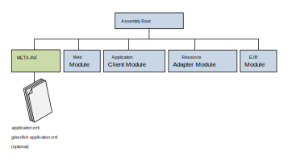
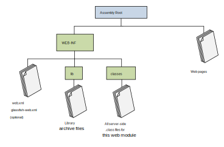

<!-- .slide: data-background-image="https://img.wallpapic-br.com/i6686-629-83/medium/cafeina-feijao-cafe-de-origem-unica-legumes-imagem-de-fundo.jpg" 
data-transition="convex"
-->
# Session Beans
<!-- .element: style="margin-bottom:100px; font-size: 60px; color:white;" -->

Pressione 'F' para tela cheia
<!-- .element: style="margin-bottom:10px; font-size: 15px; color:white;" -->

[versão em pdf](?print-pdf)
<!-- .element: style="margin-bottom 25px; font-size: 15px; color:white;" -->


# Desenvolvendo Session Beans


<!-- .slide: data-background="#F0FBFF" data-transition="fade" -->
## Desenvolvendo Session Beans
* Para desenvolver um Session Bean você necessita criar:
<!-- .element: style="margin-bottom:50px; font-size: 25px;" -->
  * **Classe do Enterprise bean:** implementa as regras de negócio de um bean
  <!-- .element: style="margin-bottom:50px; font-size: 20px;" -->

  * **Interface de negócio:** define os métodos que serão implementados por um bean
  <!-- .element: style="margin-bottom:50px; font-size: 20px;" -->
  
  * **classes Helpers :** são classes necessárias para a implementação do bean (ex.: dependências)
  <!-- .element: style="margin-bottom:50px; font-size: 20px;" -->


<!-- .slide: data-background="#F0FBFF" data-transition="fade" -->
## Interface de negócio
<!-- .element: style="margin-bottom:70px;" -->

* As interfaces de negócio de um EJB podem ser:
<!-- .element: style="margin-bottom:50px; font-size: 30px;" -->

  * Métodos públicos (no-interface view)
  <!-- .element: style="margin-bottom:50px; font-size: 25px;" -->
  * Interface de negócio:
  <!-- .element: style="margin-bottom:25px; font-size: 25px;" -->
    * Interface local
    <!-- .element: style="margin-bottom:20px; font-size: 20px;" -->
    * Interface remota
    <!-- .element: style="margin-bottom:20px; font-size: 20px;" -->


# Métodos Públicos


<!-- .slide: data-background="#FFF0FA" data-transition="slide" -->
## Métodos Públicos
<!-- .element: style="margin-bottom:50px;" -->

* A interface pública de um bean é uma visão local
<!-- .element: style="margin-bottom:50px; font-size: 25px;" -->

* Os métodos públicos da classe que implementa um enterprise bean são expostos aos clientes locais que podem acessar o bean
<!-- .element: style="margin-bottom:50px; font-size: 25px;" -->

* Enterprise beans desenvolvidos desta forma não implementam uma interface de negócio
<!-- .element: style="margin-bottom:50px; font-size: 25px;" -->


<!-- .slide: data-background="#FFF0FA" data-transition="slide" -->
## Métodos Públicos
<!-- .element: style="margin-bottom:40px;" -->

* Se a interface do bean não é decorada com @Local ou @Remote, então, por padrão, considera-se uma interface **local**
<!-- .element: style="margin-bottom:25px; font-size: 25px;" -->

* Para construir um enterprise bean que permite o acesso apenas local, você pode fazer o seguinte:
<!-- .element: style="margin-bottom:25px; font-size: 25px;" -->

  * Escrever uma classe que implementa um bean, mas, que não implemente uma interface de negócio. Isto indica que o bean expõe os seus métodos públicos, por exemplo: dollarToYen e yenToEuro
  <!-- .element: style="margin-bottom:20px; font-size: 20px;" -->

```java
package ee.jakarta.tutorial.converter.ejb;

import java.math.BigDecimal;
import jakarta.ejb.*;

@Stateless
public class ConverterBean {
    private BigDecimal yenRate = new BigDecimal("83.0602");
    private BigDecimal euroRate = new BigDecimal("0.0092016");

    public BigDecimal dollarToYen(BigDecimal dollars) {
        BigDecimal result = dollars.multiply(yenRate);
        return result.setScale(2, BigDecimal.ROUND_UP);
    }

    public BigDecimal yenToEuro(BigDecimal yen) {
        BigDecimal result = yen.multiply(euroRate);
        return result.setScale(2, BigDecimal.ROUND_UP);
    }
}
```


# Interface de Negócio Local


<!-- .slide: data-background="#F6F0FF" data-transition="concave" -->
## Clientes Locais
<!-- .element: style="margin-bottom:30px;" -->

* Um cliente local tem as seguintes características:
<!-- .element: style="margin-bottom:40px; font-size: 25px;" -->

  * Deve ser executado na mesma aplicação que o enterprise bean
  <!-- .element: style="margin-bottom:25px; font-size: 25px;" -->

  * Pode ser um componente Web ou outro enterprise bean
  <!-- .element: style="margin-bottom:25px; font-size: 25px;" -->

  * A localização do enterprise bean não é transparente
  <!-- .element: style="margin-bottom:25px; font-size: 25px;" -->


<!-- .slide: data-background="#F6F0FF" data-transition="concave" -->
## Interface de Negócio Local
<!-- .element: style="margin-bottom:40px;" -->

* Para utilizar uma interface local devemos primeiro anotar a interface de negócio do bean com @Local. Por exemplo:
<!-- .element: style="margin-bottom:25px; font-size: 25px;" -->

```java
@Local
public interface InterfaceName { ... }
```

* Depois, devemos especificar uma interface para a classe que implementa o bean por meio da anotação @Local. Por exemplo:
<!-- .element: style="margin-bottom:25px; font-size: 25px;" -->

```java
@Local(InterfaceName.class)
public class BeanName implements InterfaceName { ... }
```


# Interface de Negócio Remota


<!-- .slide: data-background="#FFF8F0" data-transition="zoom" -->
## Clientes Remotos
<!-- .element: style="margin-bottom:40px;" -->

* Um cliente remoto de um enterprise bean tem as seguintes características:
<!-- .element: style="margin-bottom:40px; font-size: 28px;" -->

  * Pode ser um componente Web, um aplicativo cliente ou outro enterprise bean
  <!-- .element: style="margin-bottom:25px; font-size: 20px;" -->

  * Pode ser executado em uma máquina diferente e uma JVM diferente do enterprise bean que ele acessa
   <!-- .element: style="margin-bottom:25px; font-size: 20px;" -->

  * A localização do enterprise bean deve ser transparente para o cliente remoto
   <!-- .element: style="margin-bottom:25px; font-size: 20px;" -->

  * O enterprise bean deve implementar uma interface de negócios, ou seja, um cliente remoto não pode acessar um bean apenas através da interface pública (no-interface view)
   <!-- .element: style="margin-bottom:25px; font-size: 20px;" -->


<!-- .slide: data-background="#FFF8F0" data-transition="zoom" -->
## Interface de Negócio Remota
<!-- .element: style="margin-bottom:40px;" -->

* Para criar um bean que permite o acesso remoto, você deve:
<!-- .element: style="margin-bottom:20px; font-size: 30px;" -->

  * Decorar a interface de negócios do enterprise bean com a anotação @Remote anotação
  <!-- .element: style="margin-bottom:20px; font-size: 20px;" -->

  ```java
  @Remote
  public interface InterfaceName {... }
  ```

  * Depois, devemos especificar uma interface para a classe que implementa o bean por meio da anotação @Remote. Por exemplo:
  <!-- .element: style="margin-bottom:20px; font-size: 20px;" -->

  ```java
  @Remote(InterfaceName.class)
  public class BeanName implements InterfaceName { ... }
  ```

  * A interface remota define os métodos de negócio e ciclo de vida que são específicos para o bean
  <!-- .element: style="margin-bottom:15px; font-size: 20px;" -->


<!-- .slide: data-background="#FFF8F0" data-transition="zoom" -->
## Interface de Negócio Remota
<!-- .element: style="margin-bottom:40px;" -->

* Depois, decore a classe do bean com @Remote, especificando as interfaces de negócio:
<!-- .element: style="margin-bottom:50px; font-size: 25px;" -->

  ```java
  @Remote(InterfaceName.class)
  public class BeanName implements InterfaceName{}
  ```
  <!-- .element: style="margin-bottom:50px; font-size: 13px;" -->

* A interface remota define os métodos de negócio e ciclo de vida que são específicos para o bean
<!-- .element: style="margin-bottom:40px; font-size: 25px;" -->


# Acessando um Enterprise Bean


<!-- .slide: data-background="#F1FFF0" data-transition="convex" -->
## Acessando um Enterprise Bean
<!-- .element: style="margin-bottom:50px;" -->

* Os clientes pode obter instâncias de um EJBs de duas maneiras:
<!-- .element: style="margin-bottom:50px; font-size: 25px;" -->

  * **[Dependency injection:](https://eclipse-ee4j.github.io/jakartaee-tutorial/#jakarta-ee-contexts-and-dependency-injection)** por meio de anotações Java
  <!-- .element: style="margin-bottom:40px; font-size: 22px;" -->

  * **Java Naming and Directory Interface ([JNDI](https://eclipse-ee4j.github.io/jakartaee-tutorial/#resources-and-jndi-naming)) lookup:** usando a sintaxe do JNDI para encontrar a instância do bean
  <!-- .element: style="margin-bottom:40px; font-size: 22px;" -->


<!-- .slide: data-background="#F1FFF0" data-transition="convex" -->
## Acessando um Enterprise Bean
<!-- .element: style="margin-bottom:50px;" -->

* Injeção de Dependência é a maneira mais fácil para obter uma referência para um enterprise bean
<!-- .element: style="margin-bottom:50px; font-size: 25px;" -->

* Entretanto, clientes que rodam fora do servidor de aplicação, como por exemplo, aplicações Java SE, necessitam localizar o bean por meio de JNDI
<!-- .element: style="margin-bottom:50px; font-size: 25px;" -->

* Por exemplo, classes POJO (*Plain Old Java Objects*) devem utilizar JNDI para acessar um session bean
<!-- .element: style="margin-bottom:50px; font-size: 25px;" -->


<!-- .slide: data-background="#F1FFF0" data-transition="convex" -->
## Acessando Beans locais
<!-- .element: style="margin-bottom:40px;" -->

* O acesso do cliente ao enterprise beans locais é feito através de injeção de dependência ou JNDI
<!-- .element: style="margin-bottom:50px; font-size: 25px;" -->

* Para obter uma referência para a interface local do bean quando por meio da injeção de dependência, use a anotação javax.ejb.EJB
<!-- .element: style="margin-bottom:40px; font-size: 25px;" -->

  ```java
  @EJB(beanName="ServiceBean”)
  private Service service;
  ```
  <!-- .element: style="margin-bottom:40px; font-size: 15px;" -->


<!-- .slide: data-background="#F1FFF0" data-transition="convex" -->
## Acessando Beans locais
<!-- .element: style="margin-bottom:70px;" -->

* Para obter uma referência através de JNDI, use os métodos da interface javax.naming.InitialContext:
<!-- .element: style="margin-bottom:40px; font-size: 25px;" -->

  ```java
  Exemplo ExampleLocal = (Exemplo) InitialContext.lookup("java:módulo / ExampleLocal");
  ```
  <!-- .element: style="margin-bottom:40px; font-size: 15px;" -->


<!-- .slide: data-background="#F1FFF0" data-transition="convex" -->
## Acessando Beans Remotos
<!-- .element: style="margin-bottom:40px;" -->

* O acesso do cliente para um bean que implementa uma interface remota é realizado através de injeção de dependência ou JNDI
<!-- .element: style="margin-bottom:40px; font-size: 25px;" -->

* Para obter uma referência para um bean que implementa uma interface de negócios remota por meio de injeção de dependência, use a anotação `javax.ejb.EJB` e especifique o nome da interface remota:
<!-- .element: style="margin-bottom:40px; font-size: 25px;" -->

```java
@EJB(beanName="ServiceBean")
private Service service;
```
<!-- .element: style="margin-bottom:40px; font-size: 15px;" -->


<!-- .slide: data-background="#F1FFF0" data-transition="convex" -->
## Acessando Beans Remotos
<!-- .element: style="margin-bottom:40px;" -->

* Para obter uma referência para a interface remota de um bean através de JNDI, use a interface javax.naming.InitialContext como forma de pesquisa:
<!-- .element: style="margin-bottom:40px; font-size: 25px;" -->

```java
ExampleRemote example = (ExampleRemote)
InitialContext.lookup("java:global/myApp/ExampleRemote");
```
<!-- .element: style="margin-bottom:40px; font-size: 15px;" -->


<!-- .slide: data-background="#F1FFF0" data-transition="convex" -->
## Sintaxe JNDI
<!-- .element: style="margin-bottom:20px;" -->

* Existem três namespaces JNDI para procurar enterprises beans: java:global, java:module, java:app
<!-- .element: style="margin-bottom:40px; font-size: 25px;" -->

  * **java:global** - é a maneira de encontrar beans remotos usando consultas JNDI. Endereços JNDI são da seguinte forma:
  <!-- .element: style="margin-bottom:40px; font-size: 25px;" -->

    * java:global[/application name]/module name/bean name[/interface name]
    <!-- .element: style="margin-bottom:40px; font-size: 20px;" -->

  * **java:module** - é utilizado para encontrar enterprise beans dentro do mesmo módulo. Endereços JNDI que utilizam java:module tem o formato:
  <!-- .element: style="margin-bottom:40px; font-size: 25px;" -->

      * java:module/bean name/[interface name]
      <!-- .element: style="margin-bottom:40px; font-size: 20px;" -->
    
  * **java:app** - é utilizado para encontrar enterprise beans dentro da mesma aplicação:
  <!-- .element: style="margin-bottom:40px; font-size: 25px;" -->

    * java:app[/module name]/enterprise bean name[/interface name]
    <!-- .element: style="margin-bottom:40px; font-size: 20px;" -->


# Empacotamento


<!-- .slide: data-background="#F0FDFF" data-transition="convex" -->
## Empacotando um EJB

* Existem duas formas de fazer um deploy de enterprise beans por meio de arquivos JAR (Java Archive):
<!-- .element: style="margin-bottom:50px; font-size: 22px;" -->

* Você pode empacotar um ou mais JARs dentro de um EAR (Enterprise Archive). Assim, quando você fizer o deploy de um EAR no servidor de aplicação todos os beans também serão implantados
<!-- .element: style="margin-bottom:50px; font-size: 22px;" -->

* Você também pode implantar um JAR EJB que não está contido em um arquivo EAR
<!-- .element: style="margin-bottom:5px; font-size: 22px;" -->

 <!-- .element height="50%" width="50%" -->

Fonte: [The Jakarta® EE Tutorial](https://eclipse-ee4j.github.io/jakartaee-tutorial/#packaging)
<!-- .element: style="margin-bottom:10px; font-size: 10px;" -->


<!-- .slide: data-background="#F0FDFF" data-transition="convex" -->
## Empacotando um EJB num Jar

* Estrutura de um JAR Enterprise Bean Empacotando um EJB
<!-- .element: style="margin-bottom 25px; font-size: 20px;" -->

 <!-- .element height="50%" width="50%" -->

Fonte: [The Jakarta® EE Tutorial](https://eclipse-ee4j.github.io/jakartaee-tutorial/#packaging)
<!-- .element: style="margin-bottom:50px; font-size: 10px;" -->


<!-- .slide: data-background="#F0FDFF" data-transition="convex" -->
## Empacotando um EJB num WAR

* Enterprises Beans frequentemente fornecem a lógica de negócios de uma aplicação Web
<!-- .element: style="margin-bottom:20px; font-size: 20px;" -->

* Assim, o empacotamento do bean dentro do módulo Web (WAR) simplifica a organização da aplicação
<!-- .element: style="margin-bottom:20px; font-size: 20px;" -->

* Enterprise beans podem ser empacotados dentro de um módulo WAR como um arquivo de classes Java
<!-- .element: style="margin-bottom:20px; font-size: 20px;" -->

* Também pode ser empacotados como arquivos JAR e incluídos dentro do WAR
<!-- .element: style="margin-bottom:5px; font-size: 20px;" -->

 <!-- .element height="50%" width="50%" -->

Fonte: [The Jakarta® EE Tutorial](https://eclipse-ee4j.github.io/jakartaee-tutorial/#packaging)
<!-- .element: style="margin-bottom:50px; font-size: 10px;" -->


<!-- .slide: data-background="#F0FDFF" data-transition="convex" -->
## Empacotando um EJB num WAR

* Para incluir uma classe de um enterprise bean em um WAR, basta colocar a classe no diretório WEB-INF/classes
<!-- .element: style="margin-bottom:50px; font-size: 20px;" -->

* Para incluir um arquivo JAR que contém um enterprise bean em um WAR, é necessário colocar o arquivo JAR dentro do diretório WEB-INF/lib
<!-- .element: style="margin-bottom:50px; font-size: 20px;" -->

* **Nota:** Arquivos JAR que contêm classes enterprises beans empacotados dentro de um módulo WAR não são considerados arquivos JAR EJB
<!-- .element: style="margin-bottom:50px; font-size: 20px;" -->

* **Nota:** Se a aplicação utilizar um EBJ deploy descriptor (ejb-jar.xml), então, este arquivo deve ser localizado no diretório WEB-INF
<!-- .element: style="margin-bottom:50px; font-size: 20px;" -->


## Referência

[The Jakarta® EE Tutorial](https://eclipse-ee4j.github.io/jakartaee-tutorial/)
<!-- .element: style="margin-bottom:50px; font-size: 20px;" -->

<center>
<a href="https://rpmhub.dev" target="blanck"></a><br/>
<a rel="license" href="http://creativecommons.org/licenses/by/4.0/">Creative Commons Atribuição 4.0 Internacional</a>
</center>