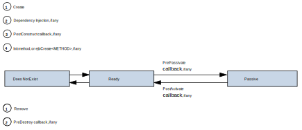

<!-- .slide: data-background-image="https://wallpaperaccess.com/full/383133.jpg" 
data-transition="convex"
-->
# Stateful Session Beans
<!-- .element: style="margin-bottom:100px; font-size: 60px; color:white;" -->

Pressione 'F' para tela cheia
<!-- .element: style="margin-bottom:10px; font-size: 15px; color:white;" -->

[versão em pdf](?print-pdf)
<!-- .element: style="margin-bottom 25px; font-size: 15px; color:white;" -->


<!-- .slide: data-background="#311F4A" data-transition="fade" -->
## Ciclo de vida de um Stateful
<!-- .element: style="margin-bottom:50px; color:white; font-size: 45px;" -->

 <!-- .element height="50%" width="50%" -->

Fonte: [The Jakarta® EE Tutorial](https://eclipse-ee4j.github.io/jakartaee-tutorial/#the-lifecycles-of-enterprise-beans)
<!-- .element: style="margin-bottom:10px; font-size: 10px; color:white" -->


<!-- .slide: data-background="#311F4A" data-transition="fade" -->
## Características
<!-- .element: style="margin-bottom:50px; color:white; font-size: 45px;" -->

* Em um Stateful os atributos representam o estado de uma sessão de cliente / bean exclusivo
<!-- .element: style="margin-bottom:50px; color:white; font-size: 25px;" -->

* Se o cliente remover o bean, a sessão termina e o estado desaparece
<!-- .element: style="margin-bottom:50px; color:white; font-size: 25px;" -->


<!-- .slide: data-background="#311F4A" data-transition="fade" -->
## Quando utilizar?
<!-- .element: style="margin-bottom:50px; color:white; font-size: 45px;" -->

* O estado do bean necessitar representar a interação entre o bean e um cliente específico
<!-- .element: style="margin-bottom:50px; color:white; font-size: 25px;" -->

* O bean faz a mediação entre o cliente e os outros componentes da aplicação, apresentando uma visão simplificada ao cliente
<!-- .element: style="margin-bottom:50px; color:white; font-size: 25px;" -->

* O bean precisa conter informações sobre o cliente nas invocações de método (workflow)
<!-- .element: style="margin-bottom:50px; color:white; font-size: 25px;" -->


<!-- .slide: data-background="white" data-transition="fade" -->
## Exemplo
<!-- .element: style="margin-bottom:10px; font-size: 30px;" -->

```java
package ee.jakarta.tutorial.cart.ejb;

import java.io.Serializable;
import java.util.ArrayList;
import java.util.List;
import ee.jakarta.tutorial.cart.util.BookException;
import ee.jakarta.tutorial.cart.util.IdVerifier;
import jakarta.ejb.Remove;
import jakarta.ejb.Stateful;

@Stateful
public class CartBean implements Cart {
    String customerId;
    String customerName;
    List<String> contents;

    @Override
    public void initialize(String person) throws BookException {
        if (person == null) {
            throw new BookException("Null person not allowed.");
        } else {
            customerName = person;
        }
        customerId = "0";
        contents = new ArrayList<>();
    }

    @Override
    public void initialize(String person, String id)
                 throws BookException {
        if (person == null) {
            throw new BookException("Null person not allowed.");
        } else {
            customerName = person;
        }

        IdVerifier idChecker = new IdVerifier();
        if (idChecker.validate(id)) {
            customerId = id;
        } else {
            throw new BookException("Invalid id: " + id);
        }

        contents = new ArrayList<>();
    }

    @Override
    public void addBook(String title) {
        contents.add(title);
    }

    @Override
    public void removeBook(String title) throws BookException {
        boolean result = contents.remove(title);
        if (result == false) {
            throw new BookException("\"" + title + " not in cart.");
        }
    }

    @Override
    public List<String> getContents() {
        return contents;
    }

    @Remove
    @Override
    public void remove() {
        contents = null;
    }
}
```
<!-- .element: style="margin-bottom:20px; font-size: 12px;" -->

Fonte: [The Jakarta® EE Tutorial](https://eclipse-ee4j.github.io/jakartaee-tutorial/#session-bean-class)
<!-- .element: style="margin-bottom:20px; font-size: 10px;" -->


## Referência

[The Jakarta® EE Tutorial](https://eclipse-ee4j.github.io/jakartaee-tutorial/)
<!-- .element: style="margin-bottom:50px; font-size: 20px;" -->

<center>
<a href="https://rpmhub.dev" target="blanck"></a><br/>
<a rel="license" href="http://creativecommons.org/licenses/by/4.0/">Creative Commons Atribuição 4.0 Internacional</a>
</center>